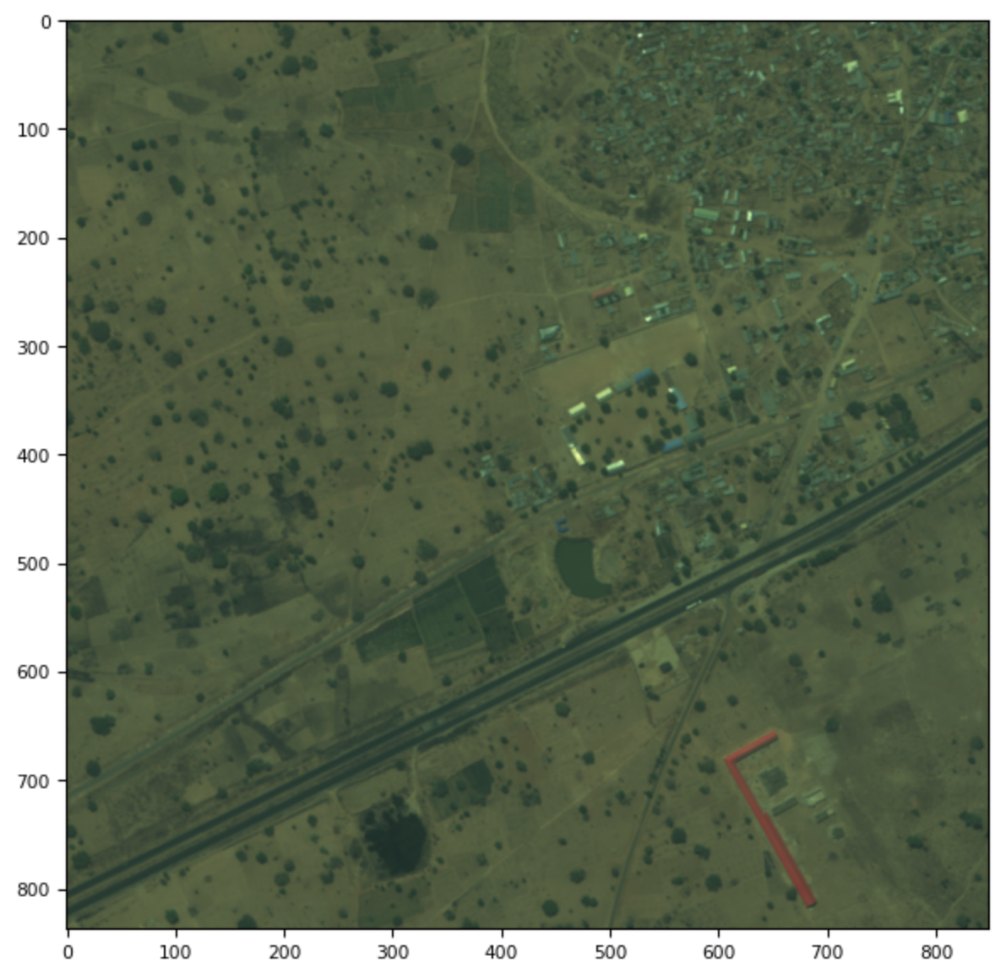
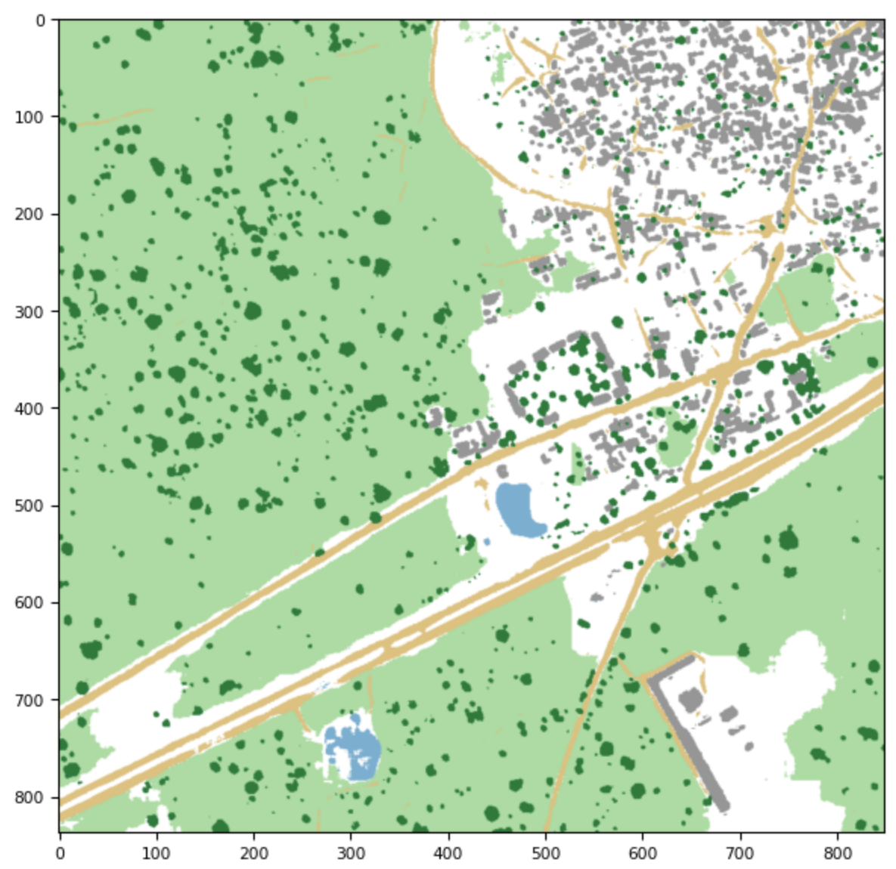

# Satellite Image Segmentation
Semantic segmentation of satellite images to produce pixel-by-pixel classifications of important regions. This was a project for my MScA-32017 advanced machine learning class.

There are 23 labeled training images and one unlabeled test image. The convolutional neural network used was a variation of the [U-Net model](https://arxiv.org/abs/1505.04597) I built from scratch. The original images are relatively large 800+ x 900+ pixel TIFF images (the images vary in size) with 8 channels. For training the network, the images are broken down to small square patches with only the three relevant RGB channels kept. Patches are randomly sampled from the images and image augmentations are applied to create an infinite set of images for training. For prediction, an image is broken down into patches equal in size to the training patches, patches are fed to the neural network and predicted, then the predictions are stitched together to produce a labeled image equal in size to the complete input image. CNNs in general (and U-Nets in particular) tend to lose accuracy for predictions near the edges of an image, so the predicted patches are designed to overlap. The overlapping sections are removed to produce a cleaner output.

An example of a full-size color input image to the network looks like this: 
 
 
And a predicted labeled output looks after stitching together the patches looks like this: 
 
 
In this labeled map, grey areas are buildings, yellow-gold are roads, dark green spots are trees, light green is farm land, blue is water, and white represents unclassified areas.